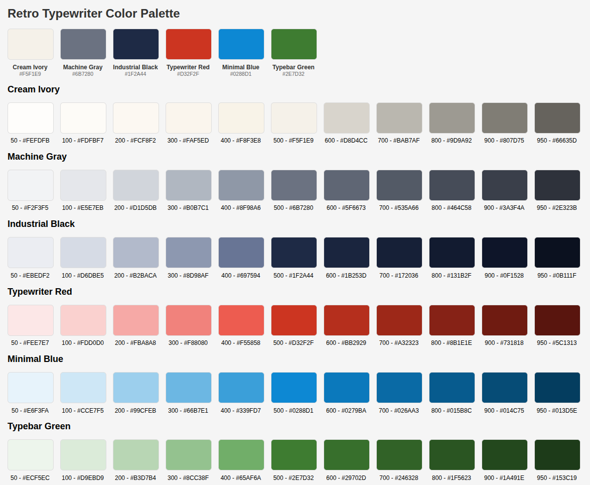

# Vintage Typewriter Palette



A retro-inspired color palette drawn from 1960s typewriters designed for web. Written in TypeScript and compatible with TailwindCSS and component libraries.
This package provides a collection of colors reminiscent of vintage typewriters, featuring shades of ivory, gray, black, red, blue, and green.

## Installation

Install the package via npm:

```bash
npm install vintage-typewriter-palette
```
